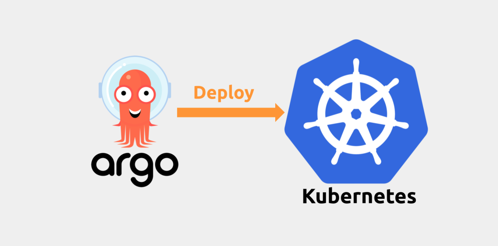

## How to install and deploy Argocd on a Kubernetes cluster



# Introduction

Argocd is a declarative GitOps continuous deployment tool that you can use to deploy and managed applications on a Kubernetes cluster.
In this article, we will install ArgoCD on Kubernetes cluster and deploy an application from a GitHub repository using ArgoCD.

# Prerequisites

- A running Kubernetes cluster
- kubectl CLI tool installed and configured to access your cluster
- A Git repository that contains your deploment yaml code in this case I'm using github.
- A container registry such as Docker Hub or Google Container Registry (GCR) to store your container images.

# install ArgoCD in k8s

To install ArgoCD using kubectl, run the following command:

```
kubectl create namespace argocd
kubectl apply -n argocd -f https://raw.githubusercontent.com/argoproj/argo-cd/stable/manifests/install.yaml
```

This will create a new namespace called argocd and install the latest version of ArgoCD on your cluster.

# Access the ArgoCD UI

By default, the Argo CD UI is not exposed externally. To access the UI, you can create a Kubernetes service of type LoadBalancer or NodePort, or you can use port forwarding to access it locally from your cluster node, in our case we will be using a service to access.

Argo CD's API server is exposed as a ClusterIP service. To access it via a NodePort service, you can modify the service type.

a. Edit the service:
```
kubectl edit svc argocd-server -n argocd
```
b. Change the service type from ClusterIP to NodePort:
```...
spec:
  ...
  type: NodePort
  ...
```
Get the NodePort port number:
```
kubectl get svc argocd-server -n argocd
```
Note down the port number associated with the argocd-server service.

To Access Argo CD UI: You can now access the Argo CD UI using the NodePort service.

```
kubectl get nodes -o wide
```

Look for the External-IP column to find the IP address of a node.
Once you have the IP address and the NodePort value (e.g., 30007), you can access the Argo CD UI in a web browser using the following URL:

```
http://<node-ip>:<node-port>
```

Replace <node-ip> with the IP address of the Kubernetes node, and <node-port> with the NodePort value you specified in the service configuration.

# login with admin user:

The default username and password for ArgoCD is admin and password. To login, navigate to the ArgoCD UI and enter these credentials.
or you could pull the secret to get the password as outlined below.

```
kubectl -n argocd get secret argocd-initial-admin-secret -o jsonpath="{.data.password}" | base64 --decode && echo
```

# Create a new Application

Once you are logged in, you can create a new application in ArgoCD. Click on the + New App button on the top right corner of the UI. This will open a form where you can specify the details of your application or you can rollout an application via the cli

In the General tab, specify the following details:

- Application name: a unique name for your application
- Project: the project to which this application belongs
- Sync Policy: how often to sync the application state with the desired state

In the Source tab, specify the following details:

- Repository URL: the URL of your Git repository
- Revision: the branch or tag to use for this application
- Path: the directory within the repository containing your Kubernetes manifests
  Helm Chart: if your application is using Helm charts, specify the chart name and version here

In the Destination tab, specify the following details:

- Namespace: the Kubernetes namespace to deploy your application to
- Server: the Kubernetes cluster to deploy your application to

# Application sync

Once you have created your application, ArgoCD will automatically start syncing it with the desired state. You can view the status of your application by clicking on its name in the UI. If there are any errors or warnings, ArgoCD will display them in the UI.

# Rolling out a New Version of your application

To roll out a new version of your application, simply push your changes to your Git repository and ArgoCD will automatically detect the changes and sync your application with the new state.


Refence:

https://www.youtube.com/watch?v=MeU5_k9ssrs&t=1170s

# Troubleshooting
Admin user account password reset: https://stackoverflow.com/questions/68297354/what-is-the-default-password-of-argocd
